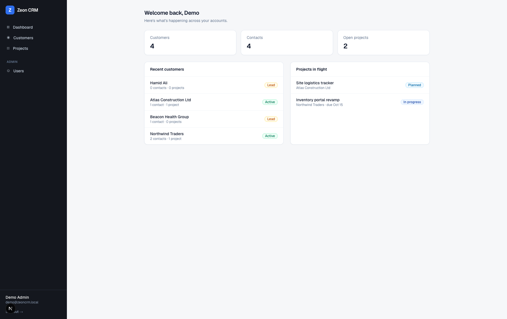
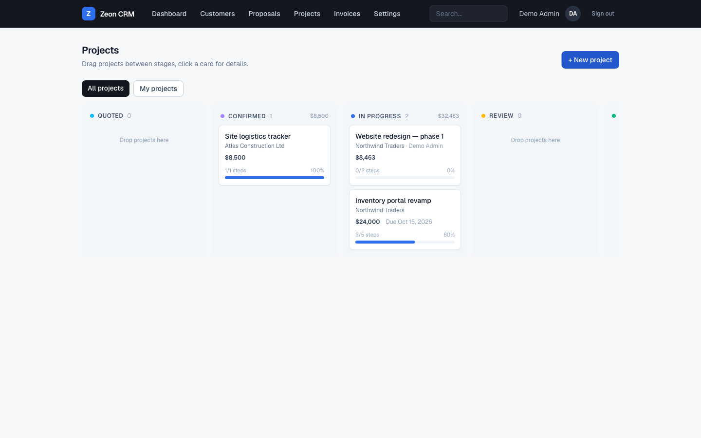
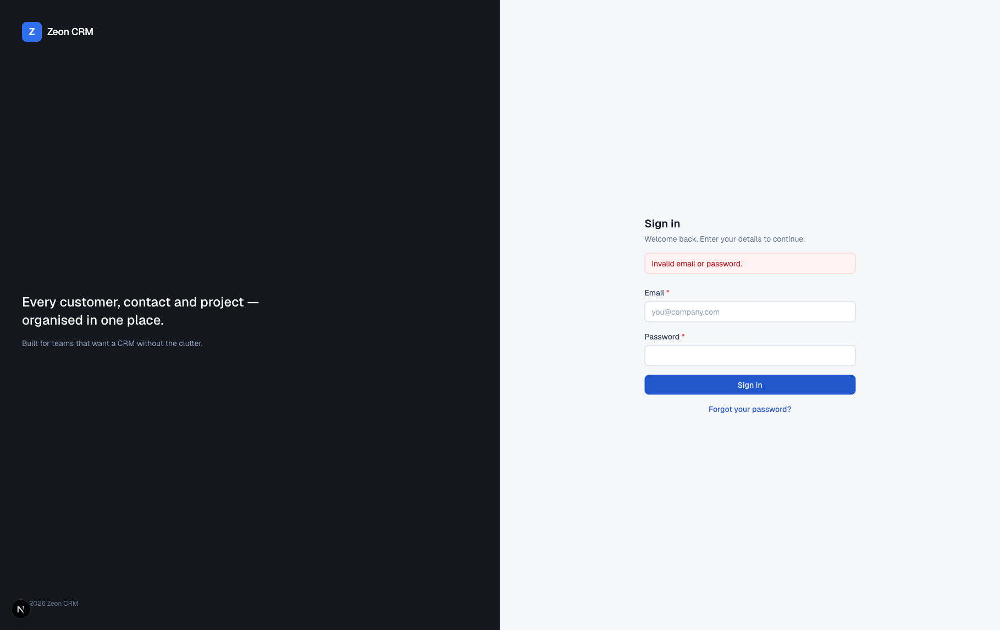
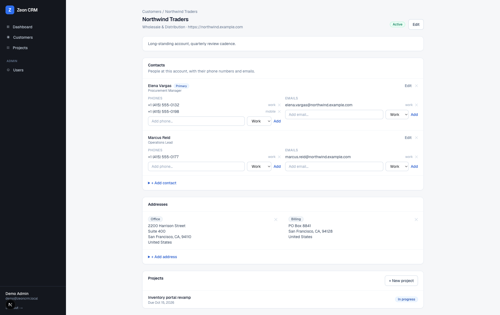

# Zeon CRM

A clean, fast CRM for managing **customers, contacts, addresses, phone numbers, emails and projects** — with team login, role-based access and password resets built in.



## Features

- **Customers** — searchable account list with status (lead / active / inactive), industry, website and notes
- **Contacts** — multiple people per customer, each with any number of phone numbers and email addresses, primary-contact flag
- **Addresses** — office / billing / shipping addresses per customer
- **Projects** — Kanban pipeline built for fixed-price service work: drag projects across Quoted → Confirmed → In progress → Review → Completed/Cancelled, click a card for an overlay with price, deadline, step checklist and complete/cancel actions
- **Authentication** — credentials login backed by bcrypt-hashed passwords (Auth.js v5, JWT sessions)
- **User management** — admins add teammates, deactivate accounts and generate one-hour password-reset links
- **Password reset** — self-service token flow (`/forgot-password` → `/reset-password/[token]`)
- **Role-based access** — admin-only areas enforced server-side, not just hidden in the UI; deactivated or deleted users are signed out on their very next request



| Login | Customer detail |
| --- | --- |
|  |  |

## Roadmap — 10-day build plan

One focused module per day. Checked off as they land on `main`.

- [ ] **Day 1 — Proposal builder (schema + editor).** `Proposal` + `ProposalItem` models linked to customers: line items with quantity × unit price, subtotal/tax/total, draft status, and a clean editor UI to compose proposals.
- [ ] **Day 2 — Proposal lifecycle & sharing.** Statuses (draft → sent → accepted / declined / expired), a print-ready proposal view, and a public tokenized share link so a client can view and accept or decline online — no login needed.
- [ ] **Day 3 — Proposal → project conversion & billing schema.** One click turns an accepted proposal into a project (price, steps pre-filled from line items). `Invoice`, `InvoiceItem` and `Payment` models with sequential invoice numbering.
- [ ] **Day 4 — Invoicing.** Create invoices from a project or proposal, invoice list + detail pages, statuses (draft / sent / paid / partially paid / overdue), print-ready invoice view with company details.
- [ ] **Day 5 — Payments & revenue dashboard.** Record payments against invoices, outstanding-balance tracking, and dashboard upgrades: pipeline value by stage, revenue this month, unpaid invoices, overdue alerts.
- [ ] **Day 6 — Activity timeline & notes.** Log calls, meetings and notes on customers and contacts; unified per-customer timeline; follow-up reminders with a "due today" list on the dashboard.
- [ ] **Day 7 — Search, filters & tags.** Global search across customers, contacts and projects; tag/segment customers; saved filter views on the customer list.
- [ ] **Day 8 — Email sending.** Wire up transactional email (Resend or SMTP): send proposals, invoices and password-reset links directly from the app, with sent-status tracking on the timeline.
- [ ] **Day 9 — Team & accountability.** Assign an account owner per customer and per project, "my work" filters, and an audit log of who changed what.
- [ ] **Day 10 — Settings, polish & release.** Company profile (name, logo, currency, tax rate) powering proposals/invoices, mobile responsiveness pass, empty-state polish, then production deploy and end-to-end smoke test.

## Stack

- [Next.js 16](https://nextjs.org) (App Router, Server Actions) + TypeScript
- [Tailwind CSS v4](https://tailwindcss.com)
- [Prisma 6](https://www.prisma.io) ORM + **MySQL 8**
- [Auth.js v5](https://authjs.dev) (NextAuth) credentials provider
- GitHub Actions CI (lint, typecheck, build)

## Local development

Requirements: Node 22+, MySQL 8 running locally.

```bash
git clone https://github.com/adilmakhdoom44/ZeonCRM.git
cd ZeonCRM
npm install

cp .env.example .env        # then edit values

# create the database (adjust user/password to your MySQL setup)
mysql -u root -e "CREATE DATABASE zeon_crm CHARACTER SET utf8mb4 COLLATE utf8mb4_unicode_ci;"

npm run db:migrate          # apply Prisma migrations
npm run db:seed             # creates the admin user + sample data
npm run dev                 # http://localhost:3000
```

Sign in with the `SEED_ADMIN_EMAIL` / `SEED_ADMIN_PASSWORD` you set in `.env`.

Useful scripts:

| Script | What it does |
| --- | --- |
| `npm run dev` | Start the dev server |
| `npm run build` | Production build |
| `npm run db:migrate` | Run Prisma migrations |
| `npm run db:seed` | Seed admin user + sample customers |
| `npm run db:studio` | Prisma Studio database browser |
| `npm run db:start` / `db:stop` | Start/stop the local MySQL server (macOS tarball install in `~/mysql`) |

## Deploying to Vercel

1. Import the GitHub repo at [vercel.com/new](https://vercel.com/new) — pushes to `main` auto-deploy from then on.
2. Provision a hosted MySQL database (PlanetScale, Railway, Aiven, etc.).
3. Set the environment variables in Vercel → Project → Settings → Environment Variables:
   - `DATABASE_URL` — the hosted MySQL connection string
   - `AUTH_SECRET` — generate with `openssl rand -base64 32`
   - `AUTH_TRUST_HOST` — `true`
   - `SEED_ADMIN_EMAIL` / `SEED_ADMIN_NAME` / `SEED_ADMIN_PASSWORD` — your first admin account
4. Apply the schema and seed the first admin from your machine:
   ```bash
   DATABASE_URL="<hosted-mysql-url>" npx prisma migrate deploy
   DATABASE_URL="<hosted-mysql-url>" SEED_ADMIN_EMAIL=... SEED_ADMIN_PASSWORD=... npx prisma db seed
   ```

## Password resets without email

No SMTP service is required: reset links are printed to the server console in development, and admins can generate a shareable reset link for any user from **Settings → Users**. Links are single-use and expire after one hour.
