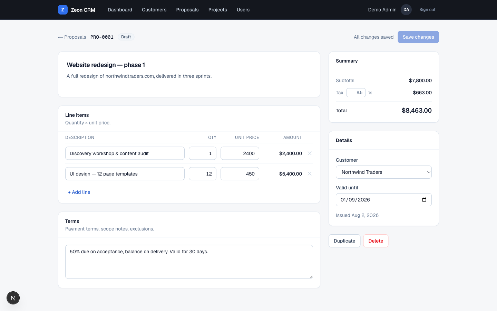
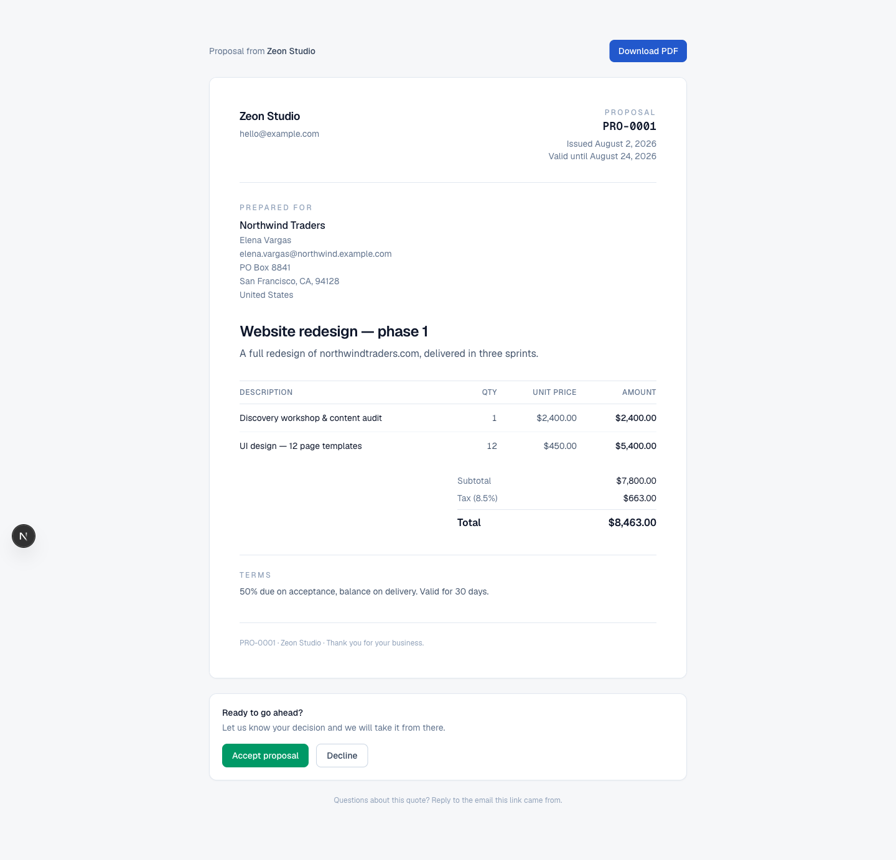

# Zeon CRM

A clean, fast CRM for managing **customers, contacts, addresses, phone numbers, emails and projects** — with team login, role-based access and password resets built in.


## Features

- **Customers** — searchable account list with status (lead / active / inactive), industry, website and notes
- **Contacts** — multiple people per customer, each with any number of phone numbers and email addresses, primary-contact flag
- **Addresses** — office / billing / shipping addresses per customer
- **Proposals** — build quotes from line items (quantity × unit price) with live subtotal, tax and total, terms, validity dates, sequential `PRO-0001` numbering and one-click duplication
- **Send & track proposals** — mark a quote as sent to lock it and mint a private share link; watch it move through sent → accepted / declined, with quotes past their validity date shown as expired automatically
- **Client acceptance without an account** — customers open the share link, read a print-ready quote and accept or decline by typing their name, which is recorded with the timestamp. Returning a proposal to draft revokes the old link
- **Won quotes become projects** — one click turns an accepted proposal into a confirmed project at the quoted total, with every line item pre-filled as a step, and links the two so the quote always points at the work it paid for
- **Projects** — Kanban pipeline built for fixed-price service work: drag projects across Quoted → Confirmed → In progress → Review → Completed/Cancelled, click a card for an overlay with price, deadline, step checklist and complete/cancel actions
- **Invoices** — bill a customer directly, or raise an invoice from a project at its agreed price or from an accepted quote line for line, with sequential `INV-0001` numbering, live totals and a print-ready document
- **Knowing what you are owed** — outstanding and overdue totals across the whole list, with each invoice's status derived from its payments and due date rather than trusted from a stored column
- **Payments** — record what arrives against an invoice (amount, method, date, reference); the invoice moves itself to part paid or paid in full, and removing a receipt walks it back
- **Dashboard that answers the money questions** — revenue received this month, outstanding, overdue and pipeline value, plus the pipeline broken down by stage, the invoices soonest due, and an alert when anything is past its date
- **Activity timeline** — log calls, meetings, notes and emails against an account in one line, optionally tied to the person and the project they concerned, with who logged it and when
- **Follow-ups that chase you** — put a date on any entry and it stays flagged until done; the dashboard lists everything due today and everything already missed
- **Search everything** — one box in the header covering customers, contacts, projects, quotes and invoices, matching names, industries, email addresses, phone numbers and document numbers like `PRO-0001`, with results grouped by kind
- **Tags & saved views** — label accounts however you segment them, filter the list by tag and status, then save that filter under a name and come back to it
- **Email that tells the truth** — send proposals, invoices and reset links from the app via Resend; every send is logged to the customer's timeline, and if no provider is configured the UI says the message was composed but not delivered rather than pretending otherwise
- **Account owners** — assign a customer or project to a teammate, see it on the list and the board, and filter to just your own with "My accounts" and "My projects"
- **Audit log** — who changed what, admin-only, filterable by record type and linking back to the thing that changed
- **Company profile** — business name, contact details, currency and default tax rate edited in the app, flowing straight onto proposals, invoices and outgoing email
- **Works on a phone** — every list scrolls inside its card rather than dragging the page sideways, and the nav scrolls instead of wrapping
- **Authentication** — credentials login backed by bcrypt-hashed passwords (Auth.js v5, JWT sessions)
- **User management** — admins add teammates, deactivate accounts and generate one-hour password-reset links
- **Password reset** — self-service token flow (`/forgot-password` → `/reset-password/[token]`)
- **Role-based access** — admin-only areas enforced server-side, not just hidden in the UI; deactivated or deleted users are signed out on their very next request




The same quote as the customer sees it — a public link, no login required:



| Login | Customer detail |
| --- | --- |
|  |  |

## Roadmap — 10-day build plan

One focused module per day. Checked off as they land on `main`.

- [x] **Day 1 — Proposal builder (schema + editor).** `Proposal` + `ProposalItem` models linked to customers: line items with quantity × unit price, subtotal/tax/total, draft status, and a clean editor UI to compose proposals.
- [x] **Day 2 — Proposal lifecycle & sharing.** Statuses (draft → sent → accepted / declined / expired), a print-ready proposal view, and a public tokenized share link so a client can view and accept or decline online — no login needed.
- [x] **Day 3 — Proposal → project conversion & billing schema.** One click turns an accepted proposal into a project (price, steps pre-filled from line items). `Invoice`, `InvoiceItem` and `Payment` models with sequential invoice numbering.
- [x] **Day 4 — Invoicing.** Create invoices from a project or proposal, invoice list + detail pages, statuses (draft / sent / paid / partially paid / overdue), print-ready invoice view with company details.
- [x] **Day 5 — Payments & revenue dashboard.** Record payments against invoices, outstanding-balance tracking, and dashboard upgrades: pipeline value by stage, revenue this month, unpaid invoices, overdue alerts.
- [x] **Day 6 — Activity timeline & notes.** Log calls, meetings and notes on customers and contacts; unified per-customer timeline; follow-up reminders with a "due today" list on the dashboard.
- [x] **Day 7 — Search, filters & tags.** Global search across customers, contacts and projects; tag/segment customers; saved filter views on the customer list.
- [x] **Day 8 — Email sending.** Wire up transactional email (Resend or SMTP): send proposals, invoices and password-reset links directly from the app, with sent-status tracking on the timeline.
- [x] **Day 9 — Team & accountability.** Assign an account owner per customer and per project, "my work" filters, and an audit log of who changed what.
- [ ] **Day 10 — Settings, polish & release.** Company profile (name, currency, tax rate) powering proposals/invoices ✅, mobile responsiveness pass ✅, test coverage for the money logic ✅ — **production deploy and smoke test still outstanding**, blocked on a hosted database (`DATABASE_URL` in Vercel is still the placeholder from `.env.example`).

## Stack

- [Next.js 16](https://nextjs.org) (App Router, Server Actions) + TypeScript
- [Tailwind CSS v4](https://tailwindcss.com)
- [Prisma 6](https://www.prisma.io) ORM + **MySQL 8**
- [Auth.js v5](https://authjs.dev) (NextAuth) credentials provider
- GitHub Actions CI (lint, typecheck, build)

## Local development

Requirements: Node 22+, MySQL 8 running locally.

```bash
git clone https://github.com/adilmakhdoom44/ZeonCRM.git
cd ZeonCRM
npm install

cp .env.example .env        # then edit values

# create the database (adjust user/password to your MySQL setup)
mysql -u root -e "CREATE DATABASE zeon_crm CHARACTER SET utf8mb4 COLLATE utf8mb4_unicode_ci;"

npm run db:migrate          # apply Prisma migrations
npm run db:seed             # creates the admin user + sample data
npm run dev                 # http://localhost:3000
```

Sign in with the `SEED_ADMIN_EMAIL` / `SEED_ADMIN_PASSWORD` you set in `.env`.

Useful scripts:

| Script | What it does |
| --- | --- |
| `npm run dev` | Start the dev server |
| `npm test` | 27 tests over the money and invoice-status logic — Node's built-in runner, nothing to install |
| `npm run build` | Production build |
| `npm run db:migrate` | Run Prisma migrations |
| `npm run db:seed` | Seed admin user + sample customers |
| `npm run db:studio` | Prisma Studio database browser |
| `npm run db:start` / `db:stop` | Start/stop the local MySQL server (macOS tarball install in `~/mysql`) |

## Deploying to Vercel

1. Import the GitHub repo at [vercel.com/new](https://vercel.com/new) — pushes to `main` auto-deploy from then on.
2. Provision a hosted MySQL database (PlanetScale, Railway, Aiven, etc.).
3. Set the environment variables in Vercel → Project → Settings → Environment Variables:
   - `DATABASE_URL` — the hosted MySQL connection string
   - `AUTH_SECRET` — generate with `openssl rand -base64 32`
   - `AUTH_TRUST_HOST` — `true`
   - `SEED_ADMIN_EMAIL` / `SEED_ADMIN_NAME` / `SEED_ADMIN_PASSWORD` — your first admin account
4. Apply the schema and seed the first admin from your machine:
   ```bash
   DATABASE_URL="<hosted-mysql-url>" npx prisma migrate deploy
   DATABASE_URL="<hosted-mysql-url>" SEED_ADMIN_EMAIL=... SEED_ADMIN_PASSWORD=... npx prisma db seed
   ```

## How proposal sharing works

Marking a proposal as sent mints a random 32-character token and exposes the quote at `/p/<token>`. That URL is the only credential, so it is treated accordingly: the page is excluded from the auth gate but reveals nothing beyond the single document — no navigation into the CRM, no customer record — and is marked `noindex`. Returning a proposal to draft clears the token, so the old link dies rather than silently showing a revised quote.

Sent proposals are locked against editing, enforced in the server action rather than only hidden in the UI. Acceptance asks the client to type their name, stored alongside the timestamp as the record of who agreed. Email delivery lands on day 8; until then, copy the link from the proposal page and send it yourself.

## Migrations in production

Vercel runs `vercel-build` in preference to `build`, so deploys apply `prisma migrate deploy` before building. CI keeps using plain `build` with a dummy `DATABASE_URL` — it has no database to migrate and should never try to reach one.

## From quote to work

An accepted proposal carries a **Create project** action. It opens the project at the quoted total — tax included, since that is what the client agreed to pay — starting in **Confirmed** with each line item as a step to tick off, then drops you on the board with that card already open.

The link is one-to-one and one-way: a proposal can only be won once (a double submit hits the same guard the UI does), and the project keeps its own life afterwards — editing the project never rewrites the quote it came from. If a project is deleted the proposal survives as the record of what was quoted.

Invoices, line items and payments now exist in the schema with sequential `INV-0001` numbering, and are wired to both projects and proposals ready for day 4. Billing history deliberately outlives its origin: deleting a project or proposal nulls the link rather than removing the invoice.

## How invoice status works

An invoice stores a status, but the app does not simply trust it. Every view derives what an invoice *actually* reads as from two facts it cannot argue with: what has been paid against it, and whether its due date has passed. Payments that cover the total make it **Paid** with no action needed; anything unpaid past its due date is **Overdue** whatever the column says. No nightly job flips states, so nothing can drift.

Payments are summed rather than kept as a running balance, so correcting or removing one can never leave an invoice disagreeing with its own receipts. Recording or removing a receipt also re-derives the stored status, so the column and the page can never tell you different things. Outstanding totals exclude drafts — they have not been asked for yet — and cancelled invoices, which are not debts.

Only drafts can be edited. Issuing an invoice locks the figures, and returning it to draft is refused once any payment has arrived, since by then the numbers are part of a settled record. Cancelling writes an invoice off rather than deleting it, so its number stays used and the sequence has no gaps.

## Email, and what happens without it

Proposals, invoices and password-reset links go out through [Resend](https://resend.com) over a plain `fetch` — one HTTP call did not justify a dependency. Set `RESEND_API_KEY` and `EMAIL_FROM` and they are delivered; sending a quote issues its share link, and sending a draft invoice issues the invoice, because a document a client has been asked to act on is no longer a draft.

**With no API key the app still works.** Messages are logged to the server console instead of delivered — and the UI says exactly that, in amber, rather than showing a green tick. Every send is also written to the customer's timeline, including whether it actually left the building. Silent non-delivery is the failure mode that costs you a client, so it is the one thing this deliberately refuses to hide.

## What the audit log covers

Deliberately not everything. It records the changes someone might later have to answer for: customers created, edited and deleted; projects moved between stages and deleted; payments recorded and removed; ownership reassigned. Editing a phone number is not in there, and does not need to be.

Entries are written alongside the change and never updated or deleted — an audit trail you can amend is not one. The actor's name is stored on the row as well as the relation, so a record still reads correctly after that person leaves and their account is removed. Audit writes are also isolated from the change itself: if the log write fails it is reported to the server console and the actual work still stands, because losing the work to save the paperwork is the wrong trade.

## Password resets without email

No SMTP service is required: reset links are printed to the server console in development, and admins can generate a shareable reset link for any user from **Settings → Users**. Links are single-use and expire after one hour.
